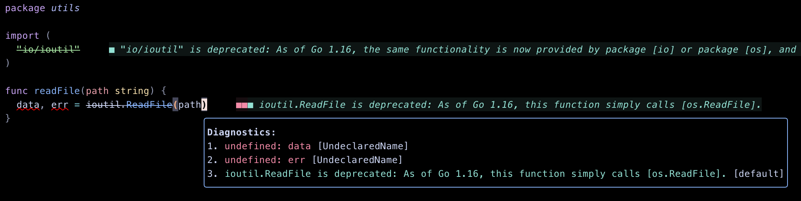

## FAULTLESS

**Faultless:** A minimalist Neovim plugin designed to enhance your development experience by displaying LSP diagnostics in a floating window.



## Installation

**Using lazy.nvim**

```lua
return {
  "https://github.com/bwcroft/faultless.nvim",
  config = function()
    local faultless = require("faultless")
    faultless.setup()

    -- Map keys to toggle the diagnostic window
    vim.keymap.set("n", "<leader>d", faultless.toggle_diagnostics)
  end
}
```

**Using packer**

```lua
use {
  "bwcroft/faultless.nvim",
  config = function()
    local faultless = require("faultless")
    faultless.setup()

    -- Map keys to toggle the diagnostic window
    vim.keymap.set("n", "<leader>d", faultless.toggle_diagnostics)
  end
}
```

**Default Configuration**
```lua
{
    bold = false,
    standout = false,
    undercurl = true,
    virtual_text = true
}
```
